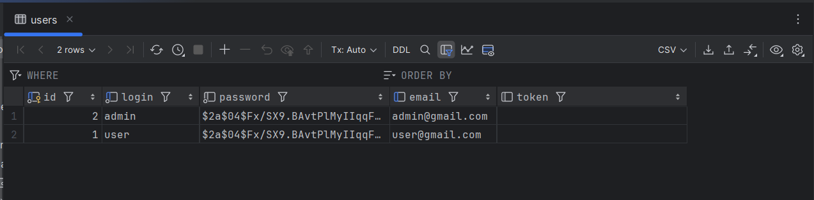
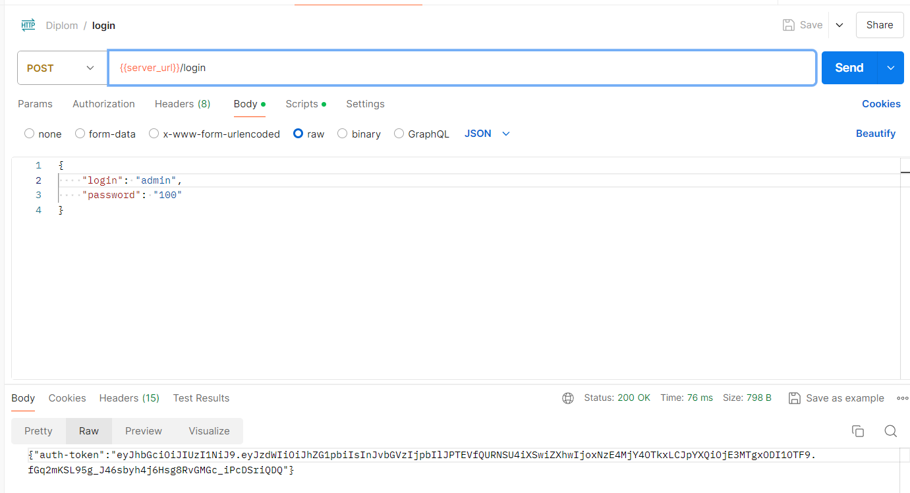
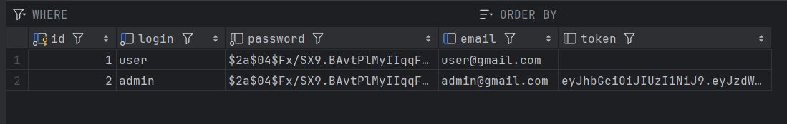
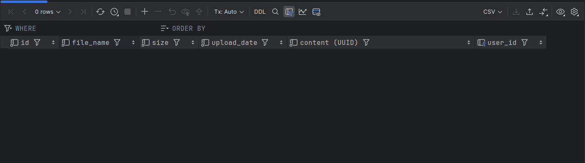
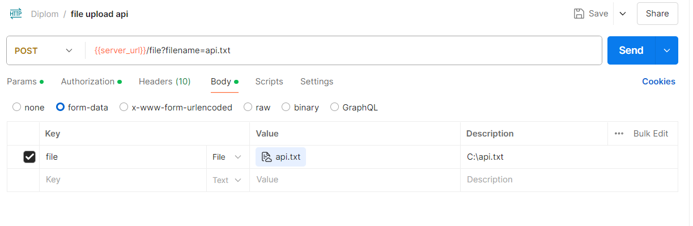
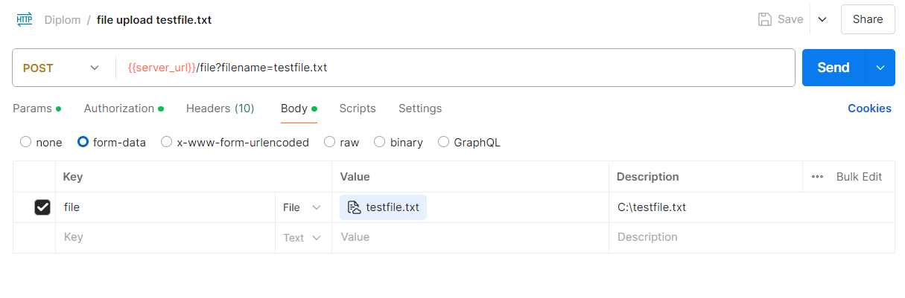
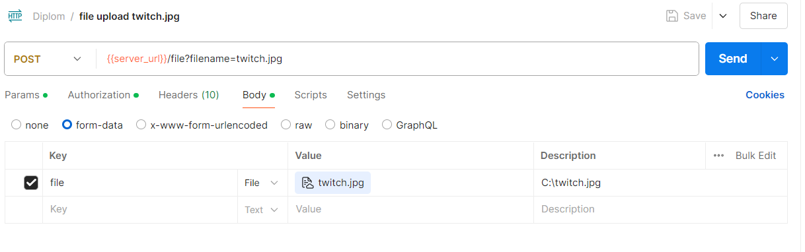
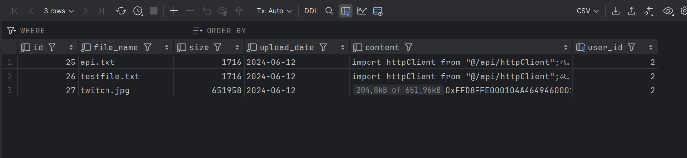

# [Дипломный проект "Облачное хранилище"](https://github.com/netology-code/jd-homeworks/blob/master/diploma/cloudservice.md)

## Описание проекта

## Технологический стек проекта:
- Spring boot
- SpringSecurity
- СУБД PostgreSQL
- Docker
- Maven
- frontend (Vue.js)

### Запуск BACKEND:

Проект запускается при помощи Docker, необходимо в корневой папке проекта выолнить команду docker-compose up.
```shell
docker-compose up
```

### Создание схемы в СУБД

Схема, таблица и пользователи создаются следующими командами описанными в [Schema.sql](https://github.com/Sonic51888/DiplomCloudService/tree/main/src/main/resources/db)
```shell
create schema IF NOT EXISTS netology;

create table IF NOT EXISTS netology.users (
                       id                    bigserial,
                       username              varchar(30) not null unique,
                       password              varchar(80) not null,
                       email                 varchar(50) unique,
                       primary key (id)
);

create table IF NOT EXISTS netology.roles (
                       id                    serial,
                       name                  varchar(50) not null,
                       primary key (id)
);

CREATE TABLE if not exists  netology.users_roles (
                             user_id               bigint not null,
                             role_id               int not null,
                             primary key (user_id, role_id),
                             foreign key (user_id) references netology.users (id),
                             foreign key (role_id) references netology.roles (id)
);

CREATE TABLE IF NOT EXISTS netology.files
(
    id                BIGINT       NOT NULL GENERATED BY DEFAULT AS IDENTITY,
    file_name              varchar(255) NOT NULL,
    size              BIGINT       NOT NULL,
    upload_date           DATE         NOT NULL,
    content bytea not null ,
    user_id           int,
    FOREIGN KEY (user_id) REFERENCES netology.users (id)
);

insert into  netology.roles (name)
values
    ('ROLE_USER'), ('ROLE_ADMIN');

insert into netology.users (login, password, email)
values
    ('user', '$2a$04$Fx/SX9.BAvtPlMyIIqqFx.hLY2Xp8nnhpzvEEVINvVpwIPbA3v/.i', 'user@gmail.com'), -- 100 пароль
    ('admin', '$2a$04$Fx/SX9.BAvtPlMyIIqqFx.hLY2Xp8nnhpzvEEVINvVpwIPbA3v/.i', 'admin@gmail.com'); -- 100 пароль

insert into netology.users_roles (user_id, role_id)
values
    (1, 1),
    (2, 2);
```

### Запуск FRONT:

1. Установите nodejs (версия не ниже 19.7.0) на компьютер, следуя [инструкции](https://nodejs.org/ru/download/current/).
2. Скачайте [FRONT](./netology-diplom-frontend) (JavaScript).
3. Перейдите в папку FRONT приложения и все команды для запуска выполняйте из неё.
4. Следуя описанию README.md FRONT проекта, запустите nodejs-приложение (`npm install`, `npm run serve`).
5. Далее нужно задать url для вызова своего backend-сервиса.
    1. В файле `.env` FRONT (находится в корне проекта) приложения нужно изменить url до backend, например: `VUE_APP_BASE_URL=http://localhost:8080`. 
       1. Нужно указать корневой url вашего backend, к нему frontend будет добавлять все пути согласно спецификации
       2. Для `VUE_APP_BASE_URL=http://localhost:8080` при выполнении логина frontend вызовет `http://localhost:8080/login`
    2. Запустите FRONT снова: `npm run serve`.
    3. Изменённый `url` сохранится для следующих запусков.
6. По умолчанию FRONT запускается на порту 8080 и доступен по url в браузере `http://localhost:8080`. 
   1. Если порт 8080 занят, FRONT займёт следующий доступный (`8081`). После выполнения `npm run serve` в терминале вы увидите, на каком порту он запустился. 

В качестве места хранилища файлов и данных о пользователях используется СУБД PostgreSQL.

##Архитектура проекта


## Тестирование

Тестирование осуществлено с помощью Postman использовалась следующая коллекция тестов [Библиотека тестов](Diplom.postman_collection.json)

### Тест №1 Авторизация
В данном тесте показывается попытка залогиниться и получить токен от сервера

Исходное состояние таблицы


Запрос в Postman


Изменения в бд после запроса токена


### Тест №2 Загрузка файла

Загрузка документов в хранилище

Исходное состояние таблицы


Загрузка файла api.txt


Загрузка файла testfile.txt


Загрузка файла twitch.jpg


Изменения в бд после загрузки файлов
